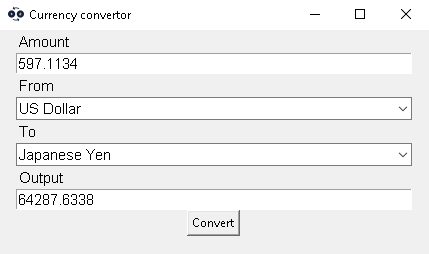

# Currency convertor
Currency converter simple program that converts currencies based on real-time prices.\
All the data was taken from the site [x-rates](https://www.x-rates.com/table/?from=USD&amount=1)\
Every use the updated currencies values are saved into __data.txt__ for later use.\
So if u don't have the internet at the time, you can still use it

## Install Requirements

```
pip install -r requirements.txt
```

## Usage
```
python cur_convertor.py
```

Your input is the amount of money u want to convert, from which currency to which currency.\
By clicking the convert button.\

